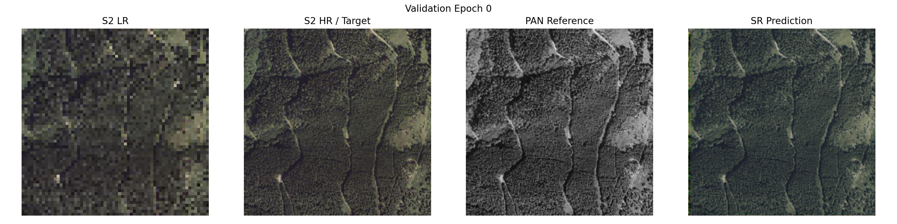
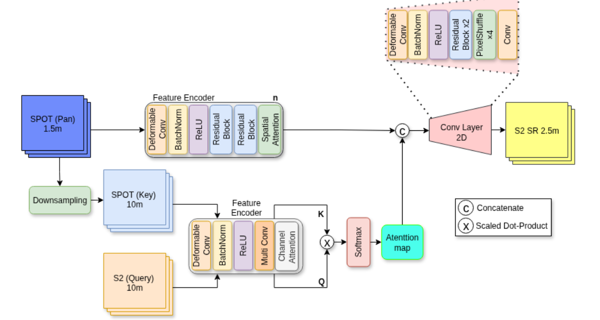

# RefSR: Reference-Guided Pan+S2 Super-Resolution




RefSR is an experimental PyTorch Lightning project that prototypes a reference-guided
super-resolution (RefSR) model for fusing Sentinel-2 multispectral inputs with
high-resolution SPOT panchromatic imagery. The current code base is intentionally
minimal so you can understand the model components quickly, plug in your own data,
and iterate on architectural ideas before scaling up to production.

---
## Repository layout
- `model/` – neural network components
  - `model.py` – top-level `PanS2FusionSR` network that ties everything together
  - `encoders.py` – HR PAN encoder plus shared 10 m encoders for Sentinel-2 and SPOT
  - `blocks.py` – reusable pieces such as deformable convolutions, residual blocks,
    spatial/channel attention, the SR head, and cross-attention map builder
- `data/example_data.py` – dummy Lightning `DataModule` that emits random tensors
  with the right shapes for smoke-testing the model and trainer loop
- `config/example_config.yaml` – single-file configuration for data/model/loss/
  optimizer/trainer hyperparameters
- `train.py` – Lightning training harness that wires the config, data module, and
  model into a runnable experiment

---
## Model Overview
`PanS2FusionSR` ingests three tensors per sample:
1. **Sentinel-2 LR (10 m) query** – multi-spectral context to be super-resolved.
2. **SPOT Panchromatic HR (≈1.5–2.5 m) reference** – high-frequency guidance.
3. **Optional SPOT Panchromatic LR (10 m) key** – downsampled reference aligned to
   Sentinel-2 resolution. If not provided, the HR panchromatic image is downsampled
   on the fly.

The network is composed of:
- **HR PAN encoder** (`PanFeatureEncoder`) that extracts high-frequency textures
  using deformable convolutions, residual refinement, and spatial attention.
- **Shared 10 m encoders** (`S2Spot10mEncoder`) for the Sentinel-2 query and the
  SPOT key. Each uses deformable convolutions, stacked Conv-BN-ReLU layers, and
  squeeze-and-excitation-style channel attention to produce aligned feature maps.
- **Cross-attention map** (`CrossAttentionMap`) that treats S2 features as queries
  and the SPOT features as keys/values to estimate spatial relevance between the
  modalities. The module flattens spatial dimensions, performs multi-head scaled
  dot-product attention, and outputs a learned attention map at 10 m resolution.
- **SR fusion head** (`SRHead`) that upsamples the attention map to the HR grid,
  concatenates it with the HR PAN features, and converts the fused features into
  super-resolved Sentinel-2 predictions via deformable convolution, residual blocks,
  and an optional pixel-shuffle upscale.

The Lightning `PanS2System` wraps this model, computes a simple L1/L2 loss against
bilinear-upsampled Sentinel-2 pseudo-targets, and exposes standard optimizer and
scheduler choices for experimentation.

---
## Getting started
1. **Install dependencies** (PyTorch, torchvision, PyTorch Lightning, OmegaConf).
2. **Tweak the config** in `config/example_config.yaml` to match your data shapes.
3. **Run the trainer**:
   ```bash
   python train.py
   ```
   By default this launches a quick 2-epoch smoke test on synthetic data so you can
   validate that the model, loss, and optimizer are wired correctly.

---


## 🔍 Sanity Check

Current Example of the model outputs:
```text
=== PanS2FusionSR Sanity Check ===
 Input S2 LR:         (2, 4, 64, 64)
 Input PAN HR:        (2, 1, 256, 256)
----------------------------------------------
 Output SR S2:        (2, 4, 256, 256)
 Attention map (10m): (2, 1, 64, 64)
==============================================

=== Parameter Summary (Trainable) ===
 Total parameters:               597,945
----------------------------------------------
 PAN HR encoder:                 149,361
 S2 10m encoder:                 115,175
 SPOT 10m encoder:               112,718
 Cross-attention module:         16,705
 Super-resolution head:          203,986
==============================================
``` 

---

## Workflow
RefSR Workflow Overview




Legend
------
[CFG]  = Configuration scope from config/example_config.yaml
[DATA] = Data handling components in data/example_data.py
[SYS]  = Lightning system defined in train.py
[NET]  = Model components in model/

```text
                          ┌───────────────────────────────────────────┐
                          │                 [CFG]                     │
                          │  config/example_config.yaml               │
                          │  ─ data hyperparams (shapes, batch)       │
                          │  ─ model hyperparams (channels, base_ch)  │
                          │  ─ loss/opt/scheduler/trainer settings    │
                          └───────────────┬───────────────────────────┘
                                          │ loads via OmegaConf.load()
                                          ▼
              ┌───────────────────────────────────────────────────────────────┐
              │                       train.py                                │
              │    PanS2System(cfg) + RandomPanS2DataModule(cfg)              │
              └──────┬───────────────────────────────┬────────────────────────┘
                     │                               │
                     │                               │ setup(), dataloaders()
                     │                               ▼
     ┌───────────────┴───────────────────────┐    ┌──────────────────────────────┐
     │                [DATA]                 │    │            [DATA]             │
     │ RandomPanS2Dataset                    │    │ RandomPanS2DataModule         │
     │  • __getitem__ emits dict:            │    │  • Splits dataset into        │
     │    {s2_lr, spot_pan_hr, spot_pan_lr}  │    │    train/val using cfg splits │
     │  • Synthetic tensors sized via cfg    │    │  • DataLoader factories feed  │
     └───────────────┬───────────────────────┘    │    batches to Lightning       │
                     │ batched dicts              └───────────────┬───────────────┘
                     │                                             │ batches
                     ▼                                             ▼
            ┌──────────────────────────────────────────────────────────────┐
            │                        [SYS]                                 │
            │           PanS2System (LightningModule)                      │
            │  • Receives batch dict from trainer loop                     │
            │  • Calls model.PanS2FusionSR                                 │
            │  • Builds bilinear SR target from s2_lr                      │
            │  • Computes L1/L2 loss                                       │
            │  • Configures optimizer/scheduler                            │
            └───────────────┬──────────────────────────────────────────────┘
                            │ (s2_lr, spot_pan_hr, spot_pan_lr)
                            ▼
                   ┌───────────────────────────────────────────────────┐
                   │                    [NET]                          │
                   │               PanS2FusionSR                       │
                   │  (model/model.py)                                 │
                   └───────────────┬───────────────────────────────────┘
                                   │
      ┌────────────────────────────┼───────────────────────────────────────────────────────────────┐
      │                            │                                                               │
      ▼                            ▼                                                               ▼
┌───────────────┐        ┌──────────────────────┐                                         ┌───────────────────┐
│PanFeature     │        │S2Spot10mEncoder      │                                         │S2Spot10mEncoder   │
│Encoder (HR)   │        │(query branch)        │                                         │(key/value branch) │
│• Deformable   │        │• Deformable Conv     │                                         │• Deformable Conv  │
│  Conv + ResBlk│        │• MultiConv stack     │                                         │• MultiConv stack  │
│• Spatial Attn │        │• Channel Attention   │                                         │• Channel Attn     │
│Inputs: spot   │        │Inputs: s2_lr         │                                         │Inputs: spot_pan_lr│
│_pan_hr        │        │Outputs: q_s2         │                                         │Outputs: k_spot    │
└───────┬───────┘        └──────────┬───────────┘                                         └─────────┬─────────┘
        │                           │                                                               │
        │                           └───────────────┬───────────────────────────────────────────────┘
        │                                           ▼
        │                                 ┌─────────────────────┐
        │                                 │ CrossAttentionMap   │
        │                                 │ • Multi-head dot    │
        │                                 │   product attention │
        │                                 │ • Att map: (B,1,H,W)│
        │                                 └──────────┬──────────┘
        │                                            │ att_map_10m
        │                                            ▼ upsample (bilinear)
        │                                 ┌────────────────────────────┐
        │                                 │  HR Attention Map          │
        │                                 │  (aligns with pan_hr grid) │
        │                                 └──────────┬─────────────────┘
        │                                            │ concat with pan_hr_feats
        ▼                                            ▼
┌─────────────────────────┐            ┌──────────────────────────────────────────┐
│ Concatenated Features   │──────────▶ │ SRHead                                   │
│ [pan_hr_feats || att_hr]│            │ • Residual + deformable conv fusion      │
└─────────────────────────┘            │ • Optional pixel-shuffle (scale=1 here)  │
                                      │ Outputs: s2_sr (B, out_ch, H_hr, W_hr)    │
                                      └──────────────────┬────────────────────────┘
                                                         │ returns (s2_sr, att_map_10m)
                                                         ▼
                                             ┌──────────────────────────────────────┐
                                             │  Lightning loss (L1/L2 vs upsampled  │
                                             │  s2_lr) + optimizer/scheduler update │
                                             └──────────────────────────────────────┘
```


## TODOs/Ideas

### 🔧 Core Model Improvements
- [ ] Make the number of **residual blocks configurable** in all encoders and the SR head.
- [ ] Add selectable **encoder depth** (number of Conv-BN-ReLU layers).
- [ ] Expose model hyperparameters via config: `base_ch`, attention heads, MLP ratio, etc.
- [ ] Add multiple **cross-attention modes** (simple dot-product, transformer, deformable attention).
- [ ] Add optional **multi-scale features** (FPN-style or U-shaped skip pathways).
- [ ] Add alternative backbones (Swin, ConvNeXt, ViT, lightweight CNNs).

### 🛰 Data realism & handling
- [ ] Replace the random data module with real geospatial loaders for S2 + SPOT.
- [ ] Add domain-specific augmentations: spectral jitter, blur kernels, noise models.

### 🧠 Loss functions & objectives
- [ ] Implement perceptual losses (VGG, LPIPS, MS-SSIM).
- [ ] Add **spectral losses** (SAM, SID, spectral correlation).
- [ ] Add radiometric-fidelity constraints (band-wise energy preservation).
- [ ] Add adversarial training option (PatchGAN, multi-scale discriminators).

### 🔭 Attention & fusion improvements
- [ ] Implement **full transformer-style** cross-attention (Q/K/V, multi-head)
- [ ] Support attention across **multiple resolutions** (10 m ↔ 2.5 m ↔ HR pyramid).

### 🚀 Model scaling & efficiency
- [ ] Support larger backbone widths (`base_ch=128/256`) for high-capacity experiments.
- [ ] Add memory-efficient attention implementations (FlashAttention, xFormers).

### 🏋️ Training loop & infrastructure
- [ ] Add proper logging (W&B, TensorBoard, CSV).
- [ ] Add validation metrics and plots during training.
- [ ] Add checkpoint saving/loading with versioned configs.
- [ ] Add LR schedulers (Cosine, Warmup, ReduceLROnPlateau).
- [ ] Support distributed training (DDP, FSDP, DeepSpeed).
- [ ] Add test-time augmentation (TTA) support.

### 📊 Evaluation & benchmarks
- [ ] Integrate PSNR, SSIM, MAE, RMSE, SAM..
- [ ] Build visual comparison utilities (side-by-side, crops, attention maps).
- [ ] Add a full validation pipeline for real S2/SPOT scenes.
- [ ] Build benchmark scripts to reproduce results across datasets.